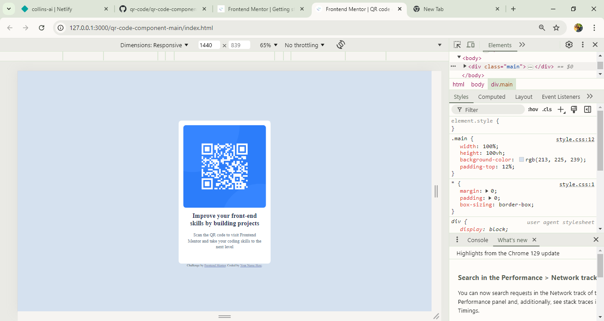

# Frontend Mentor - QR code component solution

This is a solution to the [QR code component challenge on Frontend Mentor](https://www.frontendmentor.io/challenges/qr-code-component-iux_sIO_H). Frontend Mentor challenges help you improve your coding skills by building realistic projects. 

## Table of contents

- [Overview](#overview)
  - [Screenshot](#screenshot)
  - [Links](#links)
  - [Built with](#built-with)
  - [What I learned](#what-i-learned)
  - [Continued development](#continued-development)
  - [Useful resources](#useful-resources)
- [Author](#author)

## Overview

Completing this challenge was a bit difficult for me, the reason is because it's my first challenge with frontend mentor. I struggled a lot in understanding how to work with the figma application but i'm getting used to it. I believe the next challenge will not be a problem for me.

### Screenshot

### Links

- Solution URL: [Add solution URL here](https://your-solution-url.com)
- Live Site URL: [Add live site URL here](https://your-live-site-url.com)

### Built with

- HTML5
- CSS

### What I learned

I didn't learn anything new!

The challenge only helped me to remember a few styling properties which i had forgotten.

### Continued development

I would love to focus more on responsive styling in future projects. I still find responsive styling complicated.

### Useful resources

- [w3schools](https://www.w3schools.com/) - w3schools helped me in understanding how to work with git and github.

## Author

- Frontend Mentor - [@collins-ai](https://www.frontendmentor.io/profile/collins-ai)
- Twitter - [@sundaycoll11517](https://www.twitter.com/sundaycoll11517)

